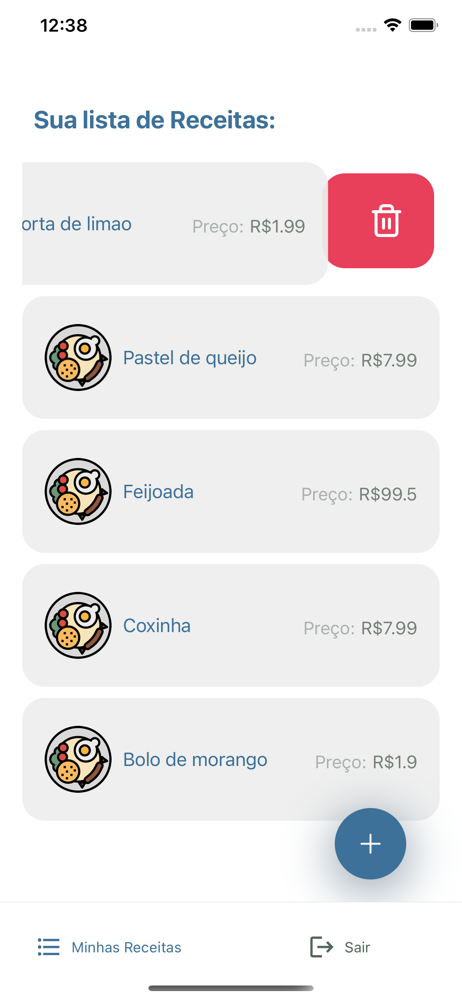

<h1 align="center">
  
</h1>

<p align="center">
  

 
 
</p>

<br>

<p align="center">
  
  
  
  
  
</p>


## ✨ Tecnologias

Esse projeto foi desenvolvido com as seguintes tecnologias:

- [React Native](https://reactnative.dev/)
- [Axios](https://github.com/axios/axios)
- [lottie-react-native](https://docs.expo.io/versions/latest/sdk/lottie/)
- [@expo/vector-icons](https://github.com/expo/vector-icons)
- [react-native-masked-text](https://github.com/benhurott/react-native-masked-text)
- [react-native-modalize](https://github.com/jeremybarbet/react-native-modalize)
- [Typescript](https://www.typescriptlang.org/)
- [Expo](https://expo.io/)

## 💻 Projeto

Aplicativo desenvolvido com o intuito de aplicar de maneira prática meu conhecimento com esta Tech. 


## 🚀 Como executar

```bash
    
    #Clonar o repositório
    $ git clone https://github.com/chagas42/Plant_Manager_NLW5

    #Entrar no diretório
    $ cd pro_Franchising

    #Instalar as dependências 
    $ yarn  

    #Iniciar o projeto
    $ expo start

```

## 📄 Licença

Esse projeto está sob a licença MIT. Veja o arquivo [LICENSE](LICENSE.md) para mais detalhes.

---

Feito com ♥ [Júnior Chagas](https://github.com/chagas42)
